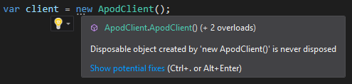

<p align="center">
  <a href="#"></a>
  <em><a href="https://www.nasa.gov/image-feature/revealing-the-milky-way-s-center">Image Credit: NASA, JPL-Caltech, Susan Stolovy (SSC/Caltech) et al.</a></em><br><br>
  <a href="https://github.com/LeMorrow/APOD.Net/actions?query=workflow%3ABuild"></a>
  <a href="https://coveralls.io/github/LeMorrow/APOD.Net?branch=master"></a>
  <a href="https://www.nuget.org/packages/APOD.Net/"></a><br>
  <a href="https://lemorrow.github.io/APOD.Net/"></a>
  <a href="https://www.nuget.org/packages/APOD.Net/"></a>
  <a href="https://github.com/LeMorrow/APOD.Net/blob/master/LICENSE"></a>
</p>

# APOD.Net
APOD.Net is a .NET library used to asynchronously interface with [NASA's Astronomy Picture of the Day API](https://api.nasa.gov#apod "Official API documentation - api.nasa.gov") (APOD). The API features a different image or photograph of our universe each day, along with a brief explanation written by a professional astronomer. [Here's what today's picture looks like](https://apod.nasa.gov/apod/astropix.html "Astronomy Picture of the Day - apod.nasa.gov")!

## ⚡ Features
- 🚀 Fast, deadlock-free asynchronous library made in pure C# **without external dependencies**. ¹ 
- 🔓 Gives you **access to all the _undocumented features_ of NASA's API**, such as getting all APODs between two dates and getting random APODs.
- 💻 Cross-platform support, targets **.NET Standard 2.0** which is supported by .NET Core 2.0+, .NET Framework 4.6.1+ and many more. [Click here for a full list of implementation support](https://docs.microsoft.com/en-us/dotnet/standard/net-standard#net-implementation-support ".NET implementation support - docs.microsoft.com").
- 🔧 **Takes care of everything you shouldn't have to care about**. HTTP requests, mapping the JSON responses to .NET objects, validating input, etc.
- ✏️ **Frictionless and easy to implement**. One API request is one method call, as it should be.
- 📖 Continuously updated **documentation**! [Click here to visit the docs](https://lemorrow.github.io/APOD.Net/ "APOD.Net Documentation").
- 💉 Completely **dependency injection-friendly** which allows you to **easily override any functionality** with your own implementations.

¹ - Uses `System.Text.Json` for deserializing the JSON. This is built-in as part of the `.NET Core 3.0` framework but is installed as a NuGet package to be compatible with the targeted `.NET Standard 2.0`. [Read more about System.Text.Json here](https://docs.microsoft.com/en-us/dotnet/standard/serialization/system-text-json-overview "JSON serialization in .NET - docs.microsoft.com").

## 🔍 Table of contents
- [ 📦 Adding APOD.Net to your project](#-adding-apodnet-to-your-project)
    - [Option 1 - Visual Studio PM Console](#option-1---visual-studio-pm-console)
    - [Option 2 - Visual Studio PM UI](#option-2---visual-studio-pm-ui)
    - [Option 3 - dotnet.exe CLI](#option-3---dotnetexe-cli)
- [ 🌟 Getting started](#-getting-started)
    - [Setting up the client](#setting-up-the-client)
    - [Making your first request](#making-your-first-request)
    - [Interpreting the response](#interpreting-the-response)
- [ 📁 More examples](#-more-examples)
- [ 💡 FAQ](#-faq)
- [ 📘 License](#-license)

## 📦 Adding APOD.Net to your project
There are many different ways to add NuGet packages to your project. Below are some of the most common methods. Refer to [this guide](https://docs.microsoft.com/en-us/nuget/consume-packages/overview-and-workflow#ways-to-install-a-nuget-package "Ways to install a NuGet Package - docs.microsoft.com") if you can't find a method that suits you.

### Option 1 - Visual Studio PM Console
1. Open your project/solution in Visual Studio
2. Open the Package Manager Console by clicking `Tools` > `NuGet Package Manager` > `Package Manager Console`
3. In the Package Manager Console window, write the following command
    ```powershell
    Install-Package APOD.Net
    ```

### Option 2 - Visual Studio PM UI
1. Open your project/solution in Visual Studio
2. Open the NuGet Package Manager by clicking `Tools` > `NuGet Package Manager` > `Manage NuGet Packages for Solution...`
3. Click `Browse` and search for `APOD.Net` and click `APOD.Net by Marcus Otterström`
4. Select the project you want to install the library in, select your desired version (`Latest stable` recommended) and click `Install`

### Option 3 - dotnet.exe CLI
1. Open a shell/command prompt and navigate to the folder with your `.csproj`
2. Write the following command
    ```sh
    dotnet add package APOD.Net
    ```

## 🌟 Getting started
This guide is intended to be read in sequencial order as every topic builds on the preceding one. They share the same context. To get started, add the [using directive](https://docs.microsoft.com/en-us/dotnet/csharp/language-reference/keywords/using-directive "using directive (C# Reference) - docs.microsoft.com").
```cs
using Apod;
```
### Setting up the client
If you are new and just want to explore the API, you can create a new [ApodClient](https://lemorrow.github.io/APOD.Net/api/Apod.ApodClient "ApodClient - APOD.Net Documentation") using the [parameterless constructor](https://lemorrow.github.io/APOD.Net/api/Apod.ApodClient.html#Apod_ApodClient__ctor "ApodClient() constructor - APOD.Net Documentation").
```cs
var client = new ApodClient();
```
This will use the API key `DEMO_KEY` which is provided by NASA as a way to explore their APIs. It has a rate limit of 50 requests **daily** per IP address.

For developing and using your application, you should [sign up for an API key](https://api.nasa.gov#signUp "Generate API Key - api.nasa.gov") which has a rate limit of 1000 requests **hourly** per IP address. To initialize the [ApodClient](https://lemorrow.github.io/APOD.Net/api/Apod.ApodClient "ApodClient - APOD.Net Documentation") with your API key, use the [ApodClient(String) constructor](https://lemorrow.github.io/APOD.Net/api/Apod.ApodClient#Apod_ApodClient__ctor_System_String_ "ApodClient(String) constructor - APOD.Net Documentation").
```cs
var client = new ApodClient("YOUR_API_KEY_HERE");
```

### Making your first request
There are numerous [available methods](https://lemorrow.github.io/APOD.Net/api/Apod.ApodClient#methods "ApodClient Methods - APOD.Net documentation") on the [ApodClient](https://lemorrow.github.io/APOD.Net/api/Apod.ApodClient "ApodClient - APOD.Net Documentation"), but for this simple example we are going to get the Astronomy Picture of the Day from my most recent birthday using [ApodClient.FetchApodAsync(DateTime)](https://lemorrow.github.io/APOD.Net/api/Apod.ApodClient#Apod_ApodClient_FetchApodAsync_DateTime_ "ApodClient.FetchApodAsync(DateTime) - APOD.Net Documentation"). I would get the APOD for your birthday, but I have no idea when that is. If I did, GitHub wouldn't be doing their GDPR right.
```cs
var date = new DateTime(2019, 06, 04);
var response = await client.FetchApodAsync(date);
```

### Interpreting the response
The method we used in the example above, [ApodClient.FetchApodAsync(DateTime)](https://lemorrow.github.io/APOD.Net/api/Apod.ApodClient#Apod_ApodClient_FetchApodAsync_DateTime_ "ApodClient.FetchApodAsync(DateTime) - APOD.Net Documentation"),  returns an [ApodResponse](https://lemorrow.github.io/APOD.Net/api/Apod.ApodResponse "ApodResponse - APOD.Net Documentation"). Instead of being impatient and immediately reading our APOD content we should make sure that the client didn't encounter any errors along the way. If the [ApodResponse.StatusCode](https://lemorrow.github.io/APOD.Net/api/Apod.ApodResponse.html#Apod_ApodResponse_StatusCode "ApodResponse.StatusCode - APOD.Net Documentation") is not `OK`, we can get information about what went wrong in the [ApodResponse.Error](https://lemorrow.github.io/APOD.Net/api/Apod.ApodResponse.html#Apod_ApodResponse_Error "ApodResponse.Error - APOD.Net Documentation").
```cs
if (response.StatusCode != ApodStatusCode.OK)
{
    Console.WriteLine("Someone's done an oopsie.");
    Console.WriteLine(response.Error.ErrorCode);
    Console.WriteLine(response.Error.ErrorMessage);
    return;
}
```
<details>
<summary>See example output</summary>
<p>

```
Someone's done an oopsie.
ApiKeyInvalid
The API key you provided was invalid. Get one at https://api.nasa.gov/.
```

</p>
</details>
<br>

When we are certain that there were no errors we can read the content from the response. The [ApodResponse.Content](https://lemorrow.github.io/APOD.Net/api/Apod.ApodResponse.html#Apod_ApodResponse_Content "ApodResponse.Content - APOD.Net Documentation") contains all the information about the Astronomy Picture of the Day. You can access properties such as [Title](https://lemorrow.github.io/APOD.Net/api/Apod.ApodContent#Apod_Logic_Net_Dtos_ApodContent_Title "ApodContent.Title - APOD.Net Documentation"), [Explanation](https://lemorrow.github.io/APOD.Net/api/Apod.ApodContent#Apod_Logic_Net_Dtos_ApodContent_Explanation "ApodContent.Explanation - APOD.Net Documentation"), [Date](https://lemorrow.github.io/APOD.Net/api/Apod.ApodContent.html#Apod_Logic_Net_Dtos_ApodContent_Date "ApodContent.Date - APOD.Net Documentation"), and [ContentUrl](https://lemorrow.github.io/APOD.Net/api/Apod.ApodContent.html#Apod_Logic_Net_Dtos_ApodContent_ContentUrl "ApodContent.ContentUrl - APOD.Net Documentation") (and more).


In the request we made previously we're expecting to get exactly **one** APOD, since we made a request for a specific date. To get our APOD, we read the value of the [ApodResponse.Content](https://lemorrow.github.io/APOD.Net/api/Apod.ApodResponse.html#Apod_ApodResponse_Content "ApodResponse.Content - APOD.Net Documentation") field.
```cs
var apod = response.Content;
Console.WriteLine(apod.Title);
Console.WriteLine(apod.ContentUrl);
Console.WriteLine(apod.Explanation);
```
<details>
<summary>See example output</summary>
<p>

```
SEIS: Listening for Marsquakes
https://apod.nasa.gov/apod/image/1906/SeismometerClouds_Insight_1021.jpg
If you put your ear to Mars, what would you hear? To find out, and to explore the unknown interior of Mars, NASA's Insight Lander deployed SEIS late last year, a sensitive seismometer that can detect marsquakes. In early April, after hearing the wind and motions initiated by the lander itself, SEIS recorded an unprecedented event that matches what was expected for a marsquake.  This event can be heard on this YouTube video.  Although Mars is not thought to have tectonic plates like the Earth, numerous faults are visible on the Martian surface which likely occurred as the hot interior of Mars cooled -- and continues to cool.  Were strong enough marsquakes to occur, SEIS could hear their rumbles reflected from large structures internal to Mars, like a liquid core, if one exists.  Pictured last week, SEIS sits quietly on the Martian surface, taking in some Sun while light clouds are visible over the horizon.   Create a Distant Legacy: Send your name to Mars
```

</p>
</details>
<br>

If we're expecting **more than one** APOD from our request (for example if we asked for the APODs between two dates), we can get all of the APODs by reading the value of the [ApodResponse.AllContent](https://lemorrow.github.io/APOD.Net/api/Apod.ApodResponse#Apod_ApodResponse_AllContent "ApodResponse.AllContent - APOD.Net Documentation") field.
```cs
foreach(var apod in response.AllContent)
{
    var formattedDate = apod.Date.ToString("MMMM d, yyyy");
    Console.WriteLine($"{formattedDate}: \"{apod.Title}\".");
}
```
<details>
<summary>See example output</summary>
<p>

Example request
```cs
var startDate = new DateTime(2008, 10, 29);
var endDate = new DateTime(2008, 11, 02);
var response = await client.FetchApodAsync(startDate, endDate);
```

Example response
```
October 29, 2008: "Mirach's Ghost".
October 30, 2008: "Haunting the Cepheus Flare".
October 31, 2008: "A Witch by Starlight".
November 1, 2008: "A Spectre in the Eastern Veil".
November 2, 2008: "Spicules: Jets on the Sun".
```

</p>
</details>

### Disposing the client
Since the [ApodClient](https://lemorrow.github.io/APOD.Net/api/Apod.ApodClient "ApodClient - APOD.Net Documentation") uses an [HttpRequester](https://lemorrow.github.io/APOD.Net/api/Apod.Logic.Net.HttpRequester "HttpRequester - APOD.Net Documentation") which in turn uses an [HttpClient](https://docs.microsoft.com/en-us/dotnet/api/system.net.http.httpclient?view=netstandard-2.0 "HttpClient - docs.microsoft.com")
which should be disposed, the [ApodClient](https://lemorrow.github.io/APOD.Net/api/Apod.ApodClient "ApodClient - APOD.Net Documentation") is responsible for cleaning up the [HttpClient](https://docs.microsoft.com/en-us/dotnet/api/system.net.http.httpclient?view=netstandard-2.0 "HttpClient - docs.microsoft.com").


To do this, call the [Dispose()](https://lemorrow.github.io/APOD.Net/api/Apod.ApodClient.html#Apod_ApodClient_Dispose "Dispose() - APOD.Net Documentation") method on the client when you are done using it. The client will become unusable after calling this method.
```cs
client.Dispose();
```

If you are only going to use the [ApodClient](https://lemorrow.github.io/APOD.Net/api/Apod.ApodClient "ApodClient - APOD.Net Documentation") once in your application, you can construct and use it in a [using statement](https://docs.microsoft.com/en-us/dotnet/csharp/language-reference/keywords/using-statement "using statement (C# Reference) - docs.microsoft.com"). The client will not be usable outside the block and will be disposed of correctly.
```cs
using (var client = new ApodClient("YOUR_API_KEY_HERE"))
{
    // Use client here
}
```

💡 Bonus tip: If you are using C# 8.0 or later, you can use the alternative syntax for the using statement that doesn't require braces.
The client will be disposed of when it falls out of scope.
```cs
using var client = new ApodClient("YOUR_API_KEY_HERE");
```

## 📁 More examples
You can find more examples in [the documentation](https://lemorrow.github.io/APOD.Net/examples/ "Examples - APOD.Net Documentation").

## 💡 FAQ
Can't find your question here? Feel free to [open an issue](https://github.com/LeMorrow/APOD.Net/issues/new/choose "Open an issue - github.com/LeMorrow/APOD.Net")!

* [Disposable object created by 'new ApodClient()' is never disposed](#disposable-object-created-by-new-apodclient-is-never-disposed)
* [When do new APODs get published by NASA?](#when-do-new-apods-get-published-by-nasa)
* [What does ApodResponse.Content return if ApodResponse.AllContent has more than one APOD?](#what-does-apodresponsecontent-return-if-apodresponseallcontent-has-more-than-one-apod)
* [What do I use the ApodClient(String, IHttpRequester, IHttpResponseParser, IErrorHandler) constructor for?](#what-do-i-use-the-apodclientstring-ihttprequester-ihttpresponseparser-ierrorhandler-constructor-for)

### Disposable object created by 'new ApodClient()' is never disposed


Read the chapter "[Disposing the client](#disposing-the-client)".

### When do new APODs get published by NASA?
Because of daylight saving time, it depends. NASA is running the code in the [Eastern Time Zone](https://en.wikipedia.org/wiki/Eastern_Time_Zone "Eastern Time Zone - en.wikipedia.org").

The table below will likely change in the future. Thanks, time zones.<br>

| Time period start        | Time period end          | Time of publication |
| ------------------------ | ------------------------ | ------------------- |
| Second Sunday in March   | First Sunday in November | 00:00 UTC-04:00     |
| First Sunday in November | Second Sunday in March   | 00:00 UTC-05:00     |

*Want to learn more about the problems with time zones? Watch [this](https://www.youtube.com/watch?v=-5wpm-gesOY "The Problem with Time & Timezones - youtube.com") youtube video from Computerphile (featuring Tom Scott).*

### When was the first APOD published?
The first APOD was published June 16th 1995 ([link](https://apod.nasa.gov/apod/ap950616.html)). However, the next 3 dates, June 17th, June 18th and June 19th, do not have any APODs. 

In conclusion, there has been an Astronomy Picture of the Day every single day from June 20th 1995 and onward.

### What does [ApodResponse.Content](https://lemorrow.github.io/APOD.Net/api/Apod.ApodResponse#Apod_ApodResponse_Content "ApodResponse.Content - APOD.Net Documentation") return if [ApodResponse.AllContent](https://lemorrow.github.io/APOD.Net/api/Apod.ApodResponse#Apod_ApodResponse_AllContent "ApodResponse.AllContent - APOD.Net Documentation") has more than one APOD?
[ApodResponse.Content](https://lemorrow.github.io/APOD.Net/api/Apod.ApodResponse#Apod_ApodResponse_Content "ApodResponse.Content - APOD.Net Documentation") will return the APOD with the most recent date.

### What do I use the [ApodClient(String, IHttpRequester, IHttpResponseParser, IErrorHandler) constructor](https://lemorrow.github.io/APOD.Net/api/Apod.ApodClient#Apod_ApodClient__ctor_System_String_Apod_Logic_Net_IHttpRequester_Apod_Logic_Net_IHttpResponseParser_Apod_Logic_Errors_IErrorHandler_ "ApodClient(String, IHttpRequester, IHttpResponseParser, IErrorHandler) constructor - APOD.Net Documentation") for?
You can use this constructor to override the behaviour of the [ApodClient](https://lemorrow.github.io/APOD.Net/api/Apod.ApodClient "ApodClient - APOD.Net Documentation") to your liking. Maybe you know some secret optimizing tricks (if you do, [open a pull request](https://github.com/LeMorrow/APOD.Net/compare "Open a pull request - github.com/LeMorrow/APOD.Net")) or maybe you want custom error handling. In that case you can inject your own implementation of [IErrorHandler](https://lemorrow.github.io/APOD.Net/api/Apod.Logic.Errors.IErrorHandler.html "IErrorHandler - APOD.Net Documentation").

## 📘 License
APOD.Net is licensed under the MIT License. Read the full license [here](https://github.com/LeMorrow/APOD.Net/blob/master/LICENSE "LICENSE - github.com/LeMorrow/APOD.Net").
