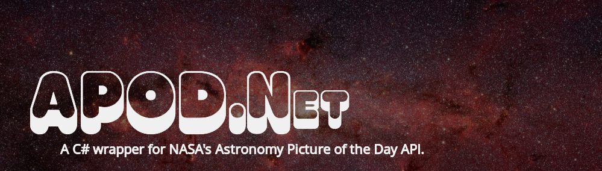

  
  <em><a href="https://www.nasa.gov/image-feature/revealing-the-milky-way-s-center" target="_blank">Image Credit: NASA, JPL-Caltech, Susan Stolovy (SSC/Caltech) et al.</a></em>

# APOD.Net

This library is currently being built. Usage and documentation will be found here later.
