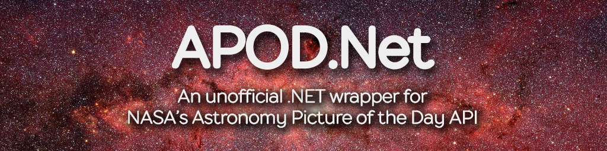

<p align="center">
  <a href="#"></a>
  <em><a href="https://www.nasa.gov/image-feature/revealing-the-milky-way-s-center" target="_blank">Image Credit: NASA, JPL-Caltech, Susan Stolovy (SSC/Caltech) et al.</a></em><br>
  
</p>

# APOD.Net
:warning: This project is still in it's infancy - please understand that many features will be changed in the final product.

## What is APOD.Net?
APOD.Net is an asynchronous .NET library used to interface with [NASA's Astronomy Picture of the Day API](https://api.nasa.gov/).

## Example usage
See all example projects [here](../src/ExampleUsage/).
```cs
using System;
using System.Threading.Tasks;
using Apod;

namespace ApodExample
{
    public class Program
    {
        private static async Task Main()
        {
            var apodClient = new ApodClient("YOUR_API_KEY_HERE");
            var apod = await apodClient.FetchApodAsync();

            Console.WriteLine(apod.Title);
            Console.WriteLine(apod.Explanation);
            Console.WriteLine(apod.ContentUrlHD);
        }
    }
}
```
